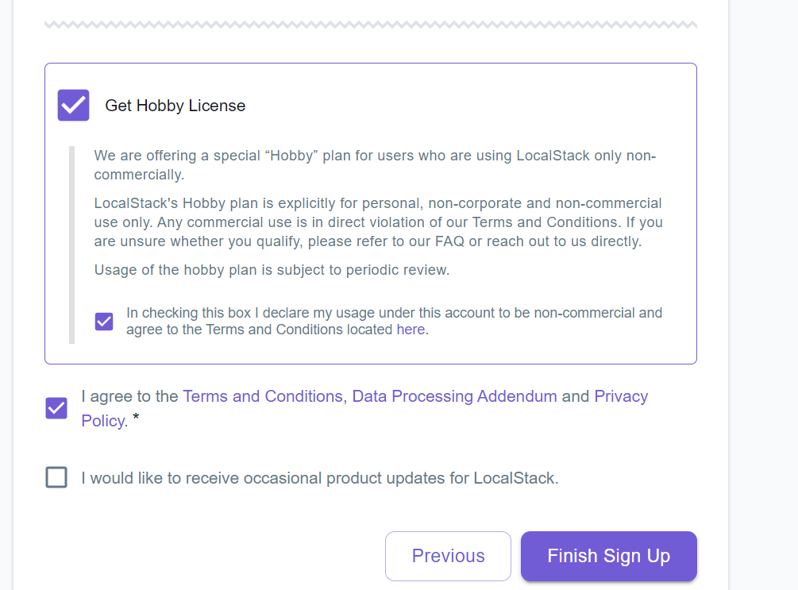
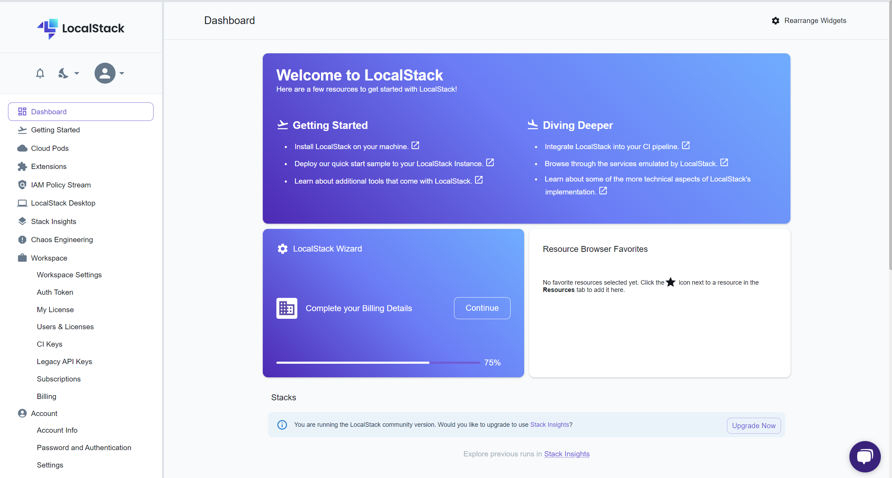
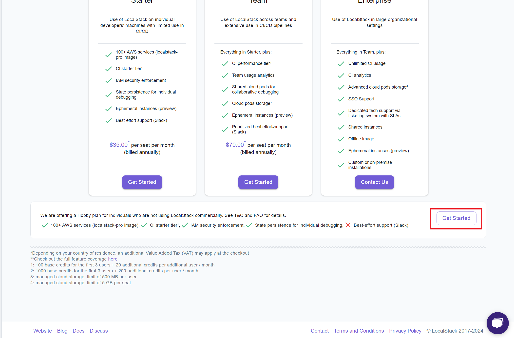
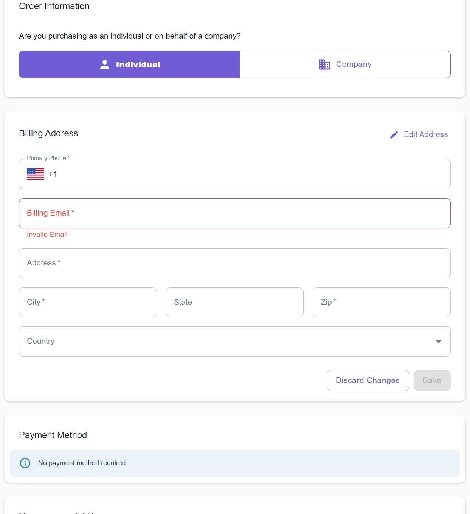
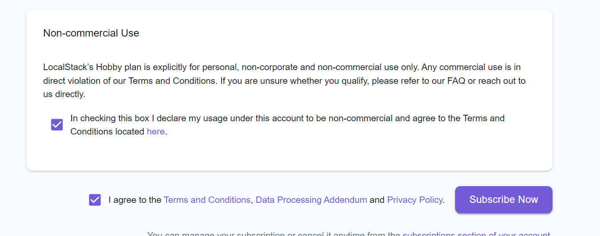

# localstack
# Setup Localstack Pro Version for Personal Use (Hobbyist Plan)

## Table of Contents
1. [Create an Account](#create-an-account)
2. [Choose Hobbyist Plan](#choose-hobbyist-plan)
3. [Launch Docker-Compose](#launch-docker-compose)

## Create an Account

1. Go to [Localstack Cloud Sign-In](https://app.localstack.cloud/sign-in).
2. Sign in with GitHub.

## Choose Hobbyist Plan

1. Check "Get Hobby License" and agree to the terms.
   
   

2. In the dashboard, click on "Upgrade Now".
   
   

3. Choose "Get Started" under all packs.
   
   

4. Select "Individual", fill in the required fields, and check "Non-commercial Use".
   
   
   
   

5. Copy your auth token from the "Auth Token" category.
   
   

6. Paste your auth token in place of `YOUR_TOKEN` in the environment variables of the `docker-compose.yml` file:

   ```yaml
   LOCALSTACK_AUTH_TOKEN="YOUR_TOKEN"
   ```

## Launch Docker-Compose

To launch Docker-Compose, use the following command:

```sh
docker-compose up -d
```